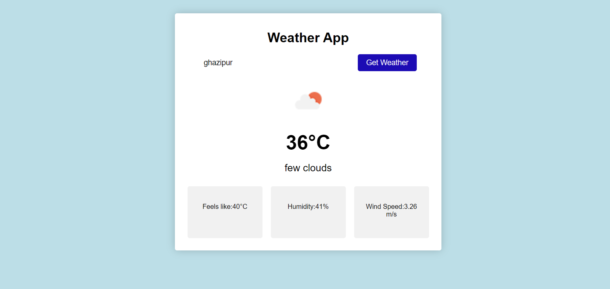

# Weather App

The Weather App is a simple web application that allows users to retrieve and display weather information for a specific city.

## Features

- Input field for entering the city name.
- "Get Weather" button to fetch weather data.
- Display of weather icon, current temperature, and weather description.

## Usage

1. Open the `index.html` file in a web browser.
2. Enter the name of the city for which you want to retrieve weather information.
3. Click the "Get Weather" button.
4. Weather information will be displayed, including the weather icon, temperature, and description.

## How It Works

The app uses the OpenWeatherMap API to fetch weather data based on the provided city name. The fetched data is then dynamically displayed on the webpage.

## Technologies Used

- HTML
- CSS
- JavaScript
- OpenWeatherMap API

## Contributing

Contributions are welcome! If you have suggestions, enhancements, or bug fixes, please submit a pull request.

## License

This project is licensed under the [MIT License](LICENSE).
